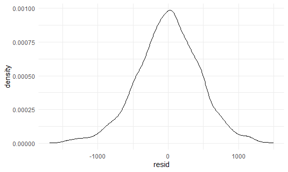
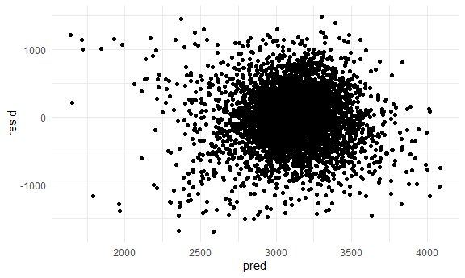
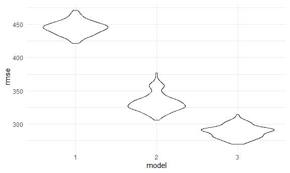
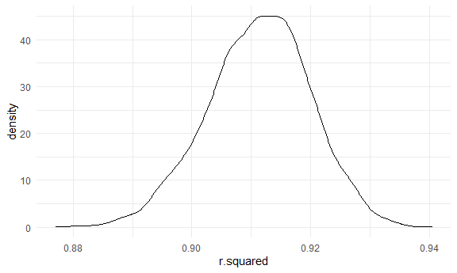
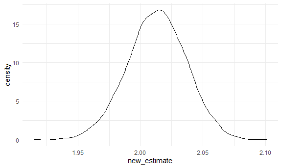

hw6
================
Henry Stoddard
11/24/2020

Load in libraries and settings

## Problem 1

``` r
homicide_df =
  read_csv("data/homicide-data.csv", na = c("", "NA", "Unknown")) %>% 
  mutate(
    city_state = str_c(city, state, sep = ", "),
    victim_age = as.numeric(victim_age),
    resolution = case_when(
      disposition == "Closed without arrest" ~ 0,
      disposition == "Open/No arrest" ~ 0,
      disposition == "Closed by arrest" ~ 1)
    ) %>% 
  filter(victim_race %in% c("White", "Black"),
         city_state != "Tulsa, AL") %>% 
  select(city_state, resolution, victim_age, victim_race, victim_sex)
```

    ## Parsed with column specification:
    ## cols(
    ##   uid = col_character(),
    ##   reported_date = col_double(),
    ##   victim_last = col_character(),
    ##   victim_first = col_character(),
    ##   victim_race = col_character(),
    ##   victim_age = col_double(),
    ##   victim_sex = col_character(),
    ##   city = col_character(),
    ##   state = col_character(),
    ##   lat = col_double(),
    ##   lon = col_double(),
    ##   disposition = col_character()
    ## )

starting with one city

``` r
baltimore_df =
  homicide_df %>% 
  filter(city_state == "Baltimore, MD")

glm(resolution ~ victim_age + victim_race + victim_sex, data = baltimore_df, family = binomial()) %>% 
  broom::tidy() %>% 
  mutate(
    OR = exp(estimate),
    CI_lower = exp(estimate - 1.96*std.error),
    CI_upper = exp(estimate + 1.96*std.error)
  ) %>% 
  select(term, OR, starts_with("CI")) %>% 
  knitr::kable(digits = 3)
```

| term              |    OR | CI\_lower | CI\_upper |
| :---------------- | ----: | --------: | --------: |
| (Intercept)       | 1.363 |     0.975 |     1.907 |
| victim\_age       | 0.993 |     0.987 |     1.000 |
| victim\_raceWhite | 2.320 |     1.648 |     3.268 |
| victim\_sexMale   | 0.426 |     0.325 |     0.558 |

Now we will nest to get df for each city and then map across each city,
then tidy results to produce new dataframe with desired outcomes.

``` r
model_results_df =
homicide_df %>% 
  nest(data = -city_state) %>% 
  mutate(
    models = map(.x = data, ~glm(resolution ~ victim_age + victim_race + victim_sex, data = .x, family = binomial())),
    results = map(models, broom::tidy)
  ) %>% 
  select(city_state, results) %>% 
  unnest(results) %>% 
  mutate(
    OR = exp(estimate),
    CI_lower = exp(estimate - 1.96*std.error),
    CI_upper = exp(estimate + 1.96*std.error)
  ) %>% 
  select(term, OR, starts_with("CI"))
```

in each city, are arrests resolved differently by sex of victim?

``` r
model_results_df %>% 
  filter(term == "victim_sexMale") %>% 
  mutate(city_state = fct_reorder(city_state, OR)) %>% 
  ggplot(aes(x = city_state, y = OR)) +
  geom_point() +
  geom_errorbar(aes(ymin = CI_lower, ymax = CI_upper)) +
  theme(axis.text.x = element_text(angle = 90, hjust = 1))
```

 The
plot seems to show a pretty wide variation in ORs. The lowest OR is in
New York, the highest OR is in Albuquerque.

## Problem 2

Loading in and cleaning data

``` r
bw_df =
  read.csv("./data/birthweight.csv") %>% 
  mutate(
    babysex = as.factor(babysex),
    frace = as.factor(frace),
    malform = as.factor(malform),
    mrace = as.factor(mrace)
  )
summary(bw_df)
```

    ##  babysex      bhead          blength           bwt           delwt      
    ##  1:2230   Min.   :21.00   Min.   :20.00   Min.   : 595   Min.   : 86.0  
    ##  2:2112   1st Qu.:33.00   1st Qu.:48.00   1st Qu.:2807   1st Qu.:131.0  
    ##           Median :34.00   Median :50.00   Median :3132   Median :143.0  
    ##           Mean   :33.65   Mean   :49.75   Mean   :3114   Mean   :145.6  
    ##           3rd Qu.:35.00   3rd Qu.:51.00   3rd Qu.:3459   3rd Qu.:157.0  
    ##           Max.   :41.00   Max.   :63.00   Max.   :4791   Max.   :334.0  
    ##     fincome      frace       gaweeks      malform     menarche    
    ##  Min.   : 0.00   1:2123   Min.   :17.70   0:4327   Min.   : 0.00  
    ##  1st Qu.:25.00   2:1911   1st Qu.:38.30   1:  15   1st Qu.:12.00  
    ##  Median :35.00   3:  46   Median :39.90            Median :12.00  
    ##  Mean   :44.11   4: 248   Mean   :39.43            Mean   :12.51  
    ##  3rd Qu.:65.00   8:  14   3rd Qu.:41.10            3rd Qu.:13.00  
    ##  Max.   :96.00            Max.   :51.30            Max.   :19.00  
    ##     mheight          momage     mrace        parity            pnumlbw 
    ##  Min.   :48.00   Min.   :12.0   1:2147   Min.   :0.000000   Min.   :0  
    ##  1st Qu.:62.00   1st Qu.:18.0   2:1909   1st Qu.:0.000000   1st Qu.:0  
    ##  Median :63.00   Median :20.0   3:  43   Median :0.000000   Median :0  
    ##  Mean   :63.49   Mean   :20.3   4: 243   Mean   :0.002303   Mean   :0  
    ##  3rd Qu.:65.00   3rd Qu.:22.0            3rd Qu.:0.000000   3rd Qu.:0  
    ##  Max.   :77.00   Max.   :44.0            Max.   :6.000000   Max.   :0  
    ##     pnumsga      ppbmi            ppwt           smoken           wtgain      
    ##  Min.   :0   Min.   :13.07   Min.   : 70.0   Min.   : 0.000   Min.   :-46.00  
    ##  1st Qu.:0   1st Qu.:19.53   1st Qu.:110.0   1st Qu.: 0.000   1st Qu.: 15.00  
    ##  Median :0   Median :21.03   Median :120.0   Median : 0.000   Median : 22.00  
    ##  Mean   :0   Mean   :21.57   Mean   :123.5   Mean   : 4.145   Mean   : 22.08  
    ##  3rd Qu.:0   3rd Qu.:22.91   3rd Qu.:134.0   3rd Qu.: 5.000   3rd Qu.: 28.00  
    ##  Max.   :0   Max.   :46.10   Max.   :287.0   Max.   :60.000   Max.   : 89.00

``` r
any(is.na(bw_df))
```

    ## [1] FALSE

Categorical vars have been turned into factors from numeric. There
appears to be no missing data.

To create a model, I googled things that predict birthweight and found a
webpage on Webmd that referenced a study by Duke researchers. Their
model included fetal sex, stage of pregnancy, mother’s height and
weight, weight gain during pregnancy, and number of other children.
Though their variables were slightly different, we have variables that
are close enough to mimic such a model. Here is the model for
birthweight:

``` r
model_1 =
  lm(bwt ~ babysex + gaweeks + mheight + delwt + wtgain + parity, bw_df)
broom::glance(model_1)
```

    ## # A tibble: 1 x 12
    ##   r.squared adj.r.squared sigma statistic   p.value    df  logLik    AIC    BIC
    ##       <dbl>         <dbl> <dbl>     <dbl>     <dbl> <dbl>   <dbl>  <dbl>  <dbl>
    ## 1     0.253         0.252  443.      245. 1.01e-270     6 -32614. 65244. 65295.
    ## # ... with 3 more variables: deviance <dbl>, df.residual <int>, nobs <int>

``` r
broom::tidy(model_1) %>% knitr::kable(digits = 3)
```

| term        |   estimate | std.error | statistic | p.value |
| :---------- | ---------: | --------: | --------: | ------: |
| (Intercept) | \-1121.348 |   180.495 |   \-6.213 |   0.000 |
| babysex2    |   \-91.526 |    13.462 |   \-6.799 |   0.000 |
| gaweeks     |     60.604 |     2.168 |    27.950 |   0.000 |
| mheight     |     20.101 |     2.810 |     7.153 |   0.000 |
| delwt       |      3.354 |     0.371 |     9.036 |   0.000 |
| wtgain      |      5.711 |     0.691 |     8.265 |   0.000 |
| parity      |    120.170 |    65.556 |     1.833 |   0.067 |

``` r
plot_distrib =
  bw_df %>% 
  add_residuals(model_1) %>% 
  ggplot(aes(x=resid)) +
  geom_density()
plot_distrib
```



``` r
plot_1 =
  bw_df %>% 
  add_predictions(model_1) %>% 
  add_residuals(model_1) %>% 
  ggplot(aes(x = pred, y = resid)) +
  geom_point()
plot_1
```



Residuals look normally distributed. Plotting residuals against
predictions looks pretty good and there are no obvious outliers.

Now making two additional models, plus looking at their summaries.

``` r
model_2 =
  lm(bwt ~ blength + gaweeks, bw_df)
broom::tidy(model_2) %>% knitr::kable(digits = 3)
```

| term        |   estimate | std.error | statistic | p.value |
| :---------- | ---------: | --------: | --------: | ------: |
| (Intercept) | \-4347.667 |    97.958 |  \-44.383 |       0 |
| blength     |    128.556 |     1.990 |    64.604 |       0 |
| gaweeks     |     27.047 |     1.718 |    15.744 |       0 |

``` r
model_3 =
  lm(bwt ~ blength*bhead*babysex, bw_df)
broom::tidy(model_3) %>% knitr::kable(digits = 3)
```

| term                   |   estimate | std.error | statistic | p.value |
| :--------------------- | ---------: | --------: | --------: | ------: |
| (Intercept)            | \-7176.817 |  1264.840 |   \-5.674 |   0.000 |
| blength                |    102.127 |    26.212 |     3.896 |   0.000 |
| bhead                  |    181.796 |    38.054 |     4.777 |   0.000 |
| babysex2               |   6374.868 |  1677.767 |     3.800 |   0.000 |
| blength:bhead          |    \-0.554 |     0.780 |   \-0.710 |   0.478 |
| blength:babysex2       |  \-123.773 |    35.119 |   \-3.524 |   0.000 |
| bhead:babysex2         |  \-198.393 |    51.092 |   \-3.883 |   0.000 |
| blength:bhead:babysex2 |      3.878 |     1.057 |     3.670 |   0.000 |

Trying to understand model fit using CV.

``` r
cv_df = 
  crossv_mc(bw_df, 100) %>% 
  mutate(
    train = map(train, as_tibble),
    test = map(test, as_tibble)
  )
```

See if I can fit the models to the splits …

``` r
cv_df = 
  cv_df %>% 
  mutate(
    model_1 = map(.x = train, ~lm(bwt ~ babysex + gaweeks + mheight + delwt + wtgain + parity, data = .x)),
    model_2 = map(.x = train, ~ lm(bwt ~ blength + gaweeks, data = .x)),
    model_3 = map(.x = train, ~lm(bwt ~ blength*bhead*babysex, data = .x))
  ) %>% 
  mutate(
    rmse_1 = map2_dbl(.x = model_1, .y = test, ~rmse(model = .x, data = .y)),
    rmse_2 = map2_dbl(.x = model_2, .y = test, ~rmse(model = .x, data = .y)),
    rmse_3 = map2_dbl(.x = model_3, .y = test, ~rmse(model = .x, data = .y))
  )
```

    ## Warning: Problem with `mutate()` input `rmse_1`.
    ## x prediction from a rank-deficient fit may be misleading
    ## i Input `rmse_1` is `map2_dbl(.x = model_1, .y = test, ~rmse(model = .x, data = .y))`.

    ## Warning in predict.lm(model, data): prediction from a rank-deficient fit may be
    ## misleading

Violin plot of RMSEs

``` r
cv_df %>% 
  select(starts_with("rmse")) %>% 
  pivot_longer(
    everything(),
    names_to = "model",
    values_to = "rmse",
    names_prefix = "rmse_"
  ) %>% 
  ggplot(aes(x = model, y = rmse)) +
  geom_violin()
```



Looks like model 3 is the winner, with a lower RMSE than 2 and well
lower than model 1 (sorry Duke researchers/WebMD).

## Problem 3

Importing data

``` r
weather_df = 
  rnoaa::meteo_pull_monitors(
    c("USW00094728"),
    var = c("PRCP", "TMIN", "TMAX"), 
    date_min = "2017-01-01",
    date_max = "2017-12-31") %>%
  mutate(
    name = recode(id, USW00094728 = "CentralPark_NY"),
    tmin = tmin / 10,
    tmax = tmax / 10) %>%
  select(name, id, everything())
```

    ## Registered S3 method overwritten by 'hoardr':
    ##   method           from
    ##   print.cache_info httr

    ## using cached file: C:\Users\hstod\AppData\Local\cache/R/noaa_ghcnd/USW00094728.dly

    ## date created (size, mb): 2020-12-03 15:16:10 (7.549)

    ## file min/max dates: 1869-01-01 / 2020-12-31

Now running bootstraps to make two different samples. One (called r2)
collects r^2 values for each bootstrap, then makes a density plot of the
estimates, then creates a table that shows the 95% CI. The second sample
(called beta) does the same thing but for the beta 0 and beta 1 values.
It then manipulates those values (multiplies them together and takes the
log of the product), plots the distribution of the manipulated estimate,
and creates a 95% CI.

``` r
weather_model =
  lm(tmax ~ tmin, data = weather_df)

r2 =
weather_df %>% 
  bootstrap(5000, id = "strap_number") %>% 
  mutate(
    models = map(.x = strap, ~lm(tmax ~ tmin, data = .x)), 
    results1 = map(models, broom::glance)
  ) %>% 
  select(strap_number, results1) %>% 
  unnest(results1) %>% 
  select(r.squared) 

r2_plot =
  r2 %>% 
  ggplot(aes(x=r.squared)) +
  geom_density()
r2_plot
```



``` r
r2_ci =
  r2 %>% 
  summarize(
    ci_lower = quantile(r.squared, 0.025),
    ci_upper = quantile(r.squared, 0.975)
  ) %>% 
  knitr::kable(digits = 3)
r2_ci
```

| ci\_lower | ci\_upper |
| --------: | --------: |
|     0.894 |     0.927 |

The density plot shows mostly normal distribution of r^2 values,
centering around 0.91. The confidence limits range from around 0.90 to
0.93, indicating strong, positive correlation between tmax and tmin.
This makes sense, given that I would expect a hot day with high tmax to
also have a high tmin, and same vice versa for cold days.

``` r
beta =
weather_df %>% 
  bootstrap(5000, id = "strap_number") %>% 
  mutate(
    models = map(.x = strap, ~lm(tmax ~ tmin, data = .x)), 
    results1 = map(models, broom::tidy)
  ) %>% 
  select(strap_number, results1) %>% 
  unnest(results1) %>% 
  select(strap_number, term, estimate) %>% 
  pivot_wider(names_from = term, values_from = estimate) %>% 
  group_by(strap_number) %>% 
  summarize(
    new_estimate = log(`(Intercept)`*tmin)
  )
```

    ## `summarise()` ungrouping output (override with `.groups` argument)

``` r
beta_plot =
  beta %>% 
  ggplot(aes(x=new_estimate)) +
  geom_density()
beta_plot
```



``` r
beta_ci =
  beta %>% 
  summarize(
    ci_lower = quantile(new_estimate, 0.025),
    ci_upper = quantile(new_estimate, 0.975)
  ) %>% 
  knitr::kable(digits = 3)
beta_ci
```

| ci\_lower | ci\_upper |
| --------: | --------: |
|     1.966 |     2.058 |

The density plot for the “new estimate” (which is equal to the log of
the product of b0 and b1) appears normal and centered at 2.02. The CI
for this estimate ranges from 1.97 to 2.06.
